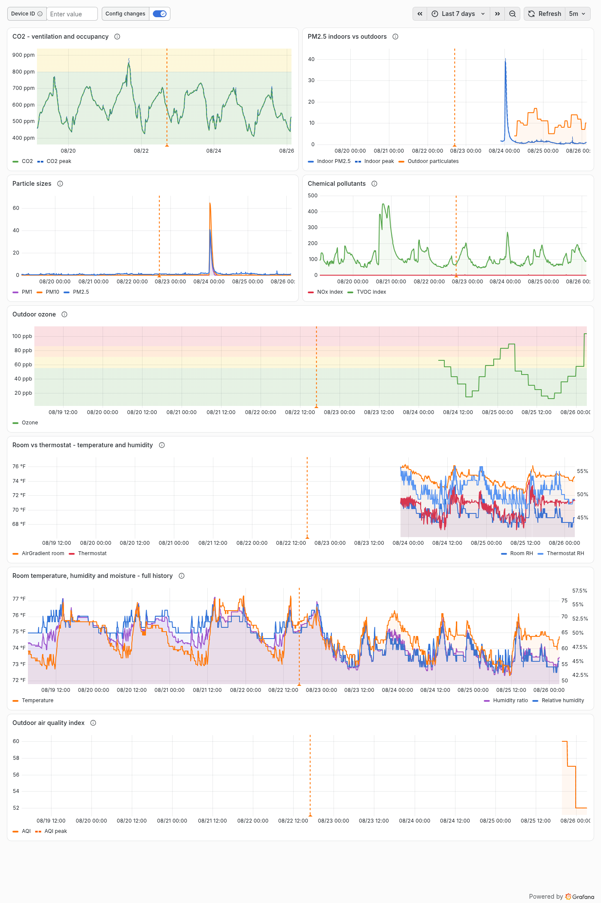
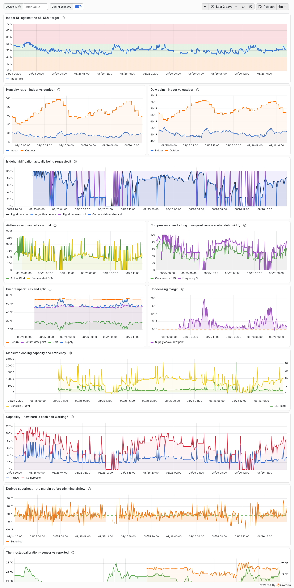
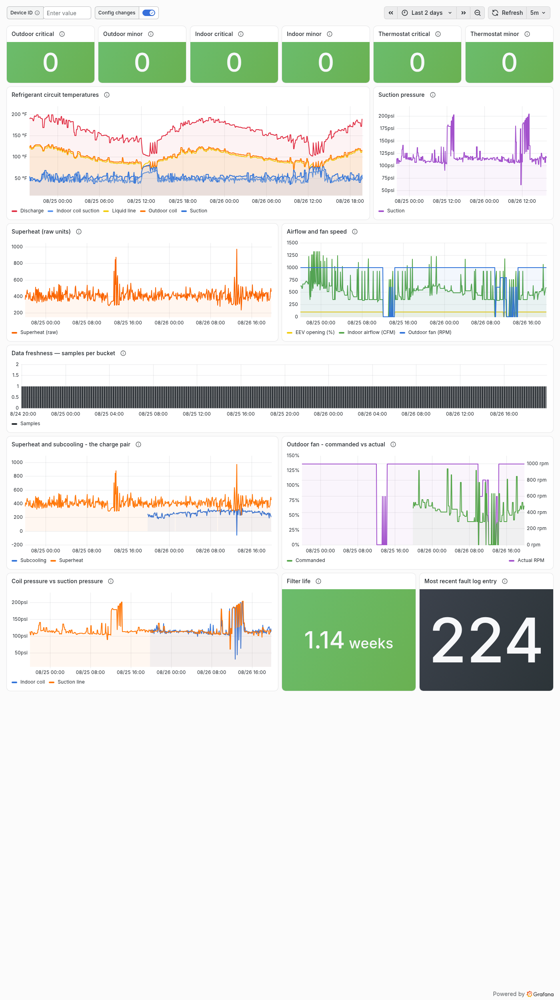
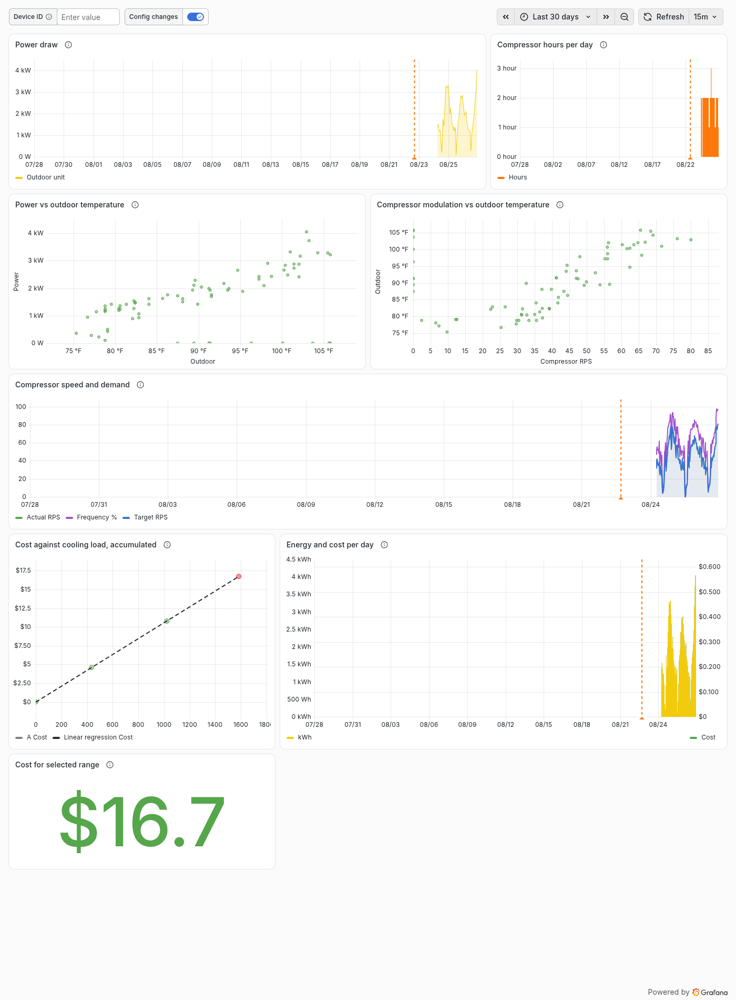

# Daikin HVAC telemetry

Collects HVAC and indoor-environment telemetry every 5 minutes, keeps it all in a Turso
database, publishes a summary to ConstantGraph, and serves it to Grafana. Compute and storage
run on the free tiers of Cloudflare Workers and Turso.

It began as a one-way bridge from a Daikin One thermostat to ConstantGraph. It now pulls from
four sources and is really a small telemetry hub with ConstantGraph as one of its outputs.

## What it looks like

Four dashboards, 44 panels, grouped by the question being asked rather than by which sensor the
data came from. All generated by `scripts/gen_dashboards.py`; the images by
`scripts/grafana_shots.py`.

### Air quality

CO₂ as an occupancy and ventilation signal, particulates indoors against outdoors, and the room
sensor's full history — which reaches further back than the bridge itself, via a CSV backfill.



### Dehumidification

Built to answer a specific question — whether the system was dehumidifying properly — and kept
because the answer needed several days of evidence. Humidity ratio rather than relative humidity,
because RH moves whenever temperature moves even when the moisture has not.



### System health

Fault registers, the refrigerant circuit, and the charge diagnostics. Superheat and subcooling
are charted as a pair: neither identifies a charge problem alone, their divergence does.



### Energy

Power against outdoor temperature is the real efficiency curve. Cost uses `RATE_PER_KWH` and
covers the outdoor unit only — the indoor power figure has an unverified scale, and a
confident-looking number of unknown magnitude is worse than an absent one.




## Data sources

| Source | API | What it adds | Required? |
|---|---|---|---|
| **Daikin One** | Integrator API, official | Temperatures, humidity, setpoints, mode, equipment status | Yes |
| **Daikin Skyport** | Consumer API, undocumented | Power draw, compressor speed, refrigerant circuit, charge diagnostics, fault codes — 58 columns | Optional |
| **Duct sensors** | ConstantGraph read API | Return and supply air temperature and humidity, from SmartThings probes | Optional |
| **AirGradient** | Public API v1 | CO₂, particulates, TVOC/NOx, a second temperature and humidity pair | Optional |

Every source but the first is optional and additive. Each is wrapped so that a failure degrades
to null columns for that cycle rather than costing the reading — a dead AirGradient token must
never stop the thermostat being recorded.

The Skyport source deserves a warning: it is the API the phone app uses, is undocumented and
unsanctioned, and can change without notice. It is a supplement, never the system of record. It
authenticates with a refresh token minted once locally, so the account password is never stored.

## Why it keeps its own copy

None of these services keeps your history. The Daikin API reports current state only, so anything
you don't poll is gone. ConstantGraph's retention is bounded even on Premium: one month of raw
5-minute data, 12 months hourly, then daily for 5 years. (Their pricing page describes the daily
rollup as lifetime and the subscriptions page says 5 years. Either way, 5-minute resolution older
than a month cannot be recovered from it.)

So Turso is the system of record and everything else is a view. Turso is also how you get at the
data from anywhere else, since it is plain SQLite over libSQL and any driver can connect to it.
For hosted dashboards that cannot reach Turso, `/api/series` serves the same data over HTTP.

## How it works

```
Cloudflare Worker  (cron: */5 * * * *)
  │
  ├─ 1. CAPTURE   Daikin integrator API   → temperatures, setpoints, status
  │               Daikin Skyport API      → power, compressor, refrigerant  (optional)
  │               ConstantGraph read API  → duct return/supply probes       (optional)
  │               AirGradient API         → CO2, particulates, TVOC         (optional)
  │               INSERT OR IGNORE into readings, published = 0
  │
  ├─ 2. PUBLISH   SELECT ... WHERE published = 0  (up to PUBLISH_BATCH)
  │               POST /data/timedata with each row's original timestamp
  │               mark published = 1 only on confirmed success
  │
  └─ 3. PRUNE     once daily, null out raw JSON older than RAW_RETENTION_DAYS
```

Only the integrator API is on the critical path. The other three are read once per cycle and
shared across thermostats, since they describe the house and the equipment rather than any
individual thermostat.

Capture and publish are independent. If ConstantGraph is unreachable for six hours, capture keeps
working and rows pile up unpublished; the next successful publish replays them at their true
timestamps, so the graph fills in retroactively instead of showing a hole. That is why this uses
`/data/timedata` (Premium) rather than `/data/data`.

Samples are snapped to their 5-minute bucket. Cron jitter therefore doesn't produce uneven
spacing, and a manual `/admin/poll` in the same window collapses onto the scheduled sample
instead of creating a near-duplicate.

## What ConstantGraph gets

ConstantGraph receives 11 channels per thermostat — the comfort metrics, not the equipment
telemetry. It requires their **Premium** tier: the `/data/timedata` endpoint this depends on is
not available below it. Everything else lives in Turso and is charted in Grafana.

## Setup

See [SETUP.md](SETUP.md).

## What gets recorded

Each thermostat gets a block of 100 ConstantGraph channel IDs starting at `CHANNEL_BASE`
(default 1000), so device 1 owns 1000–1099 and device 2 owns 1100–1199. Eleven of each hundred
are used today; the remainder leaves room to add metrics without renumbering.

| Offset | Channel | Units | DataType |
|---|---|---|---|
| +0 | Indoor Temp | °F | 11 temperature |
| +1 | Indoor Humidity | % | 7 humidity |
| +2 | Outdoor Temp | °F | 11 temperature |
| +3 | Outdoor Humidity | % | 7 humidity |
| +4 | Heat Setpoint | °F | 12 high setpoint |
| +5 | Cool Setpoint | °F | 13 low setpoint |
| +6 | Mode | 0 off, 1 heat, 2 cool, 3 auto, 4 em-heat | 5 HVAC mode status |
| +7 | Equipment Status | 1 cool, 2 overcool, 3 heat, 4 fan, 5 idle | 16 HVAC operating state |
| +8 | Heating Runtime | min | 15 sensor level |
| +9 | Cooling Runtime | min | 15 sensor level |
| +10 | Indoor−Outdoor Delta | °F | 11 temperature |

Turso keeps more than it graphs: the metrics above as typed columns, plus `setpoint_delta_c`,
`setpoint_min_c` and `setpoint_max_c` (the system's configured limits), plus the complete API
response as raw JSON. The raw JSON is pruned after `RAW_RETENTION_DAYS`, so any field outside the
typed columns is retained only for that window.

**Units.** Temperatures are stored in Celsius exactly as the API returns them, so nothing is lost
to rounding. Conversion to Fahrenheit happens once, on the way out to ConstantGraph. Queries
against the database must do the conversion themselves — see
[Querying the history](#querying-the-history). A whole-degree Fahrenheit setpoint often reads
back with a decimal (71 °F is stored as 21.7 °C, which converts back to 71.06) because the API's
0.1 °C granularity doesn't line up with whole Fahrenheit degrees.

**The setpoint DataTypes look swapped and are not.** ConstantGraph's reference defines "High
Setpoint" as the heating set point and "Low Setpoint" as the cooling one, the reverse of the
usual convention, where cooling is the numerically higher edge of the deadband. This only affects
icons and axis labelling.

**Runtime channels are estimates.** `equipmentStatus` is a point sample, not a meter. Runtime
credits the whole 5-minute interval whenever the system was running at the instant of the poll.
Over a day that is a fair duty-cycle estimate, but a cycle shorter than the sampling gap can be
missed entirely or counted as a full interval. Treat them as a trend indicator, not a total.

**Channel filtering is deliberately left off.** ConstantGraph's extreme-value filter discards
out-of-range readings rather than flagging them, so enabling it risks silently dropping a real
measurement.

## Dashboard graphs

`POST /admin/bootstrap` names the channels, registers the thermostat as a device so its channels
group together, and creates four graphs per unit:

| Graph | Window | What it shows |
|---|---|---|
| Comfort | 7 days | Indoor temp against both setpoints, with outdoor for context, all on one axis |
| Runtime (Hours per Day) | 30 days | Heating and cooling hours per day, via On Duration aggregation |
| Humidity | 7 days | Indoor vs outdoor relative humidity |
| Indoor vs Outdoor Delta | 30 days | Daily average delta, as an area chart |

Graph references are stable slugs (`daikin-1-comfort`, `daikin-2-runtime`, …), so re-running
bootstrap updates the existing graphs rather than duplicating them.

## Querying the history

This is the intended way to analyse the data. Any libSQL driver connects directly — see Turso's
[client SDK docs](https://docs.turso.tech/sdk) for Python (`libsql`), JavaScript
(`@libsql/client`), Rust (`libsql`), and Go (`libsql-client-go`).

```bash
turso db shell daikin
```

Recent readings in Fahrenheit:

```sql
SELECT datetime(ts, 'unixepoch', 'localtime') AS local_time,
       ROUND(temp_indoor_c  * 9 / 5 + 32, 1) AS indoor_f,
       ROUND(temp_outdoor_c * 9 / 5 + 32, 1) AS outdoor_f,
       hum_indoor,
       equipment_status
FROM readings
ORDER BY ts DESC
LIMIT 50;
```

Daily heating and cooling hours (the `5` is the sampling interval in minutes):

```sql
SELECT date(ts, 'unixepoch', 'localtime') AS day,
       ROUND(SUM(CASE WHEN equipment_status = 3       THEN 5 ELSE 0 END) / 60.0, 2) AS heat_hours,
       ROUND(SUM(CASE WHEN equipment_status IN (1, 2) THEN 5 ELSE 0 END) / 60.0, 2) AS cool_hours
FROM readings
GROUP BY day
ORDER BY day DESC;
```

Run time against outdoor temperature, which is roughly your system's efficiency curve:

```sql
SELECT CAST(ROUND(temp_outdoor_c * 9 / 5 + 32) AS INT) AS outdoor_f,
       COUNT(*)                                        AS samples,
       ROUND(AVG(CASE WHEN equipment_status IN (1,2,3) THEN 1.0 ELSE 0.0 END) * 100, 1) AS pct_running
FROM readings
WHERE temp_outdoor_c IS NOT NULL
GROUP BY outdoor_f
HAVING samples > 5
ORDER BY outdoor_f;
```

## Grafana dashboards

ConstantGraph covers the basics. For richer dashboards, Grafana can read this data through its
Infinity data source, which queries JSON over HTTP. Grafana cannot connect to Turso directly —
its SQLite plugin needs a local file — so `/api/series` exists to bridge that gap.

Note that Grafana only *renders* here; it stores nothing. Its free-tier retention limits (14 days
for metrics) don't apply, because the history stays in Turso.

**Set up the data source.** Infinity ships pre-installed on Grafana Cloud. Add it, then:

- Base URL: your Worker's origin
- Under *Headers*, add `X-Api-Key` with your `READ_API_KEY`
- Under *Security → Allowed hosts*, add the same origin

**Import the dashboard.** [`grafana/dashboard-v2.json`](grafana/dashboard-v2.json) is the
current one, in the `dashboard.grafana.app/v2` schema, with six panels pre-wired.
[`grafana/dashboard.json`](grafana/dashboard.json) is the same dashboard in the classic
schema for older Grafana. The v2 file references its data source by UID, so change that to
yours after importing; the classic file prompts for it instead. Dashboards → New → Import → paste the file, then pick your Infinity data source when
prompted. It ships with a `device` textbox variable; leave it blank for all thermostats or paste
an ID from `/api/stats`.

| Panel | Shows |
|---|---|
| Comfort | Indoor temp vs both setpoints and outdoor, setpoints as dashed step lines |
| Duty cycle | Percent of samples with the compressor running |
| Runtime per bucket | Heating and cooling minutes, as bars |
| Humidity | Indoor vs outdoor relative humidity |
| Indoor − Outdoor delta | How hard the envelope is working |
| Efficiency curve | Percent running against outdoor temperature, hourly buckets, XY chart |

### The other dashboards

Three dashboards, split by the question being asked and how often — not by which
sensor the data came from.

| File | Question | Cadence |
|---|---|---|
| [`dashboard.json`](grafana/dashboard.json) | Is the house comfortable and the system behaving? | Ambient, several times a day |
| [`dashboard-energy.json`](grafana/dashboard-energy.json) | What is this costing, and is it performing? | Monthly, or when a bill surprises |
| [`dashboard-health.json`](grafana/dashboard-health.json) | Is anything wrong, or slowly getting worse? | Rarely by choice — usually because an alert fired |
| [`dashboard-air.json`](grafana/dashboard-air.json) | Is the air in here any good? | Ambient |
| [`dashboard-dehum.json`](grafana/dashboard-dehum.json) | Why is indoor humidity high, and is the fix working? | Temporary — retire once the question is settled |

Grouped by the question being asked and how often, not by which sensor the data came from. Air
Quality carries EPA breakpoints as panel thresholds, so the colour states the judgement rather
than leaving you to recall whether 35 µg/m³ is bad.

Energy & Efficiency defaults to 30 days, because a single day says nothing about
cost. Its two scatter panels pin the interval to hourly rather than following the
panel resolution, which keeps the point cloud readable at any time range. The
compressor-hours panel wants a **1-day** interval: the underlying counter only
ticks once per accumulated hour, so at five minutes it reads mostly zero.

System Health leads with the six fault codes as stat panels — green at zero, red
otherwise — because that is the question the dashboard exists to answer. It also
carries a samples-per-bucket panel, which is the only thing that distinguishes
"the system is idle" from "collection broke"; without it a dead poller and a
quiet house look identical on every other chart.

### Derived columns

`/api/series` computes several values the equipment does not report directly:

- **`indoor_w_gr` / `outdoor_w_gr`** — humidity ratio in grains per pound of dry air, and
  **`indoor_dewpoint_f` / `outdoor_dewpoint_f`**. Relative humidity is temperature-dependent:
  the same moisture reads 60% at 70 °F and about 50% at 75 °F, so an RH chart conflates "the air
  got wetter" with "the setpoint moved". Humidity ratio does not, which is what makes indoor and
  outdoor directly comparable.
- **`superheat_f`** — derived from suction pressure and coil suction temperature against an
  R-410A curve, *not* read from the equipment's own superheat field, whose scale could not be
  established. Assumes the pressure sensor reports psig; the derived values landing at a textbook
  10–12 °F is the evidence for that, not a guarantee.

Conversions are applied per row inside `AVG()`, not to bucket averages — averaging relative
humidity and converting afterwards gives a different and wrong number.

**Air quality has its own table.** `readings` is keyed `(device_id, ts)` because a reading
belongs to a thermostat. Air quality belongs to the house, and its history reaches back further
than the bridge has been running — so it lives in `air_quality`, keyed on time alone, and
`/api/air` serves it. Joining it onto readings would have truncated it to whatever window the
bridge happened to be collecting for, and backfilling it into `readings` would have meant
inventing reading rows with no thermostat data, which `samples` and `pct_running` would then
have counted as equipment observed and found idle.

`/api/series` still exposes the same `ag_*` columns via a `LEFT JOIN`, for correlating air
quality against HVAC behaviour where both exist.

History predating the first poll comes from an AirGradient CSV export:

```bash
python scripts/backfill_air_csv.py "air-gradient-export/export.csv" > backfill.sql
turso db shell daikin < backfill.sql
```

Rows are keyed on the UTC timestamp snapped to a 5-minute bucket and written with
`INSERT OR REPLACE`, so re-running is safe. The `source` column marks whether a row came from a
live poll (`api`) or a backfilled export (`csv`).

**Duct sensors and measured capacity.** External return and supply probes (SmartThings,
published into ConstantGraph and read back via its read API) give
`duct_return_temp_f`, `duct_return_rh` and `duct_supply_temp_f`, from which
`/api/series` derives `duct_split_f`, `return_dewpoint_f`, `condensing_margin_f`,
`sensible_btuh`, `latent_btuh_est`, `shr_est` and `eer_est`.

Sensible capacity is exact — `1.08 × CFM × split` needs only the two temperatures. Latent is
**not**, and the distinction matters: there is no humidity sensor at the supply, so supply
humidity ratio is assumed at 95% RH and the estimate is gated on supply dry bulb sitting below
the return dew point. With the probe at a register rather than the plenum, that gate is too
strict — air leaves the coil around 45–48 °F and condenses, then warms through the duct run. So
`shr_est` of 1.0 means "no condensation visible at the probe", not "no dehumidification".
`condensing_margin_f` is the honest form of that signal, and `eer_est` is a floor.

Reading requires a ConstantGraph **read** key (`CG_READ_API_KEY`), which is a different
credential from the write key, and the channel IDs and location node are configured in
`wrangler.toml`. Set any channel to `0` to skip it.

**Marking configuration changes.** `scripts/mark-change.sh "what changed"` posts a Grafana
annotation that every dashboard renders as an orange marker. Changing one setting at a time only
yields attributable results if the change is visible on the same timeline as the effect.

### Alerting

A dashboard you have to remember to open is a poor way to notice failure, so
this is the only push mechanism in the system and worth setting up even if you
skip the charts entirely.

```bash
python scripts/gen_alerts.py           # create or update six rules
python scripts/gen_alerts.py --check   # report each rule's state and health
```

| Rule | Fires when | For | Repeat |
|---|---|---|---|
| Bridge has stopped collecting | `seconds_since_last_reading` > 600 | 10m | 4h |
| Equipment fault | any of six fault registers non-zero | 5m | 4h |
| Indoor humidity above target | `hum_indoor` > 55% | 1h | 12h |
| Air filter due | `sp_filter_days` > 183 | 6h | 1 week |
| Indoor PM2.5 elevated | `ag_pm02_max` > 35 µg/m³ | 30m | 12h |
| Indoor CO₂ elevated | `ag_co2_max` > 1200 ppm | 30m | 12h |

Collection-stalled is the one that matters most: every other rule assumes data
is arriving, and this is the only thing that notices when it stops. It reads
`/health`, which is unauthenticated, so it keeps working through a read-key
rotation. 600 seconds is two missed cron cycles, because one missed cycle is
ordinary jitter and should not page.

Repeat intervals differ by severity because a firing alert repeats until it is
fixed, and these stay breached for very different lengths of time — filter-due
holds until the filter is physically changed, which at a 4-hour repeat would be
six emails a day about a chore. See
[`grafana/alerting/README.md`](grafana/alerting/README.md) for the three
non-obvious things about Grafana alerting that this had to work around, none of
which apply to dashboard panels.

**To build panels by hand instead,** query type JSON, source URL, parser **Backend**, format
**Time Series**:

```
/api/series?from=$__from&to=$__to&interval=$__interval_ms
```

Grafana substitutes epoch milliseconds for `$__from`/`$__to` and the panel resolution for
`$__interval_ms`; the endpoint normalises all three to seconds. The Backend parser needs each
column declared under *Parsing options & Result fields*: add `time` with Format `Time`, and each
numeric column with Format `Number`. Infinity will not infer these, and a missing `time` column
is the usual cause of "Data is missing a time field".

**Alerting.** `/health` is unauthenticated and returns `seconds_since_last_reading`, so an alert
on that crossing ~600 tells you collection has stopped. That is the one alert worth having.

**Available columns.** Integrator-API metrics: `time` (ISO-8601), `ts_ms` (epoch ms),
`device_id`, `samples`, `indoor_f`, `outdoor_f`, `heat_setpoint_f`, `cool_setpoint_f`,
`hum_indoor`, `hum_outdoor`, `delta_f`, `mode`, `equipment_status`, `runtime_heat_min`,
`runtime_cool_min`, `pct_running`.

Skyport metrics (see below): all 38 `sp_*` columns from `readings`, aggregated by bucket. Most
average; `sp_compressor_runtime` and the six `sp_fault_*` columns take the bucket maximum
instead, for the reasons in the next paragraph.

Units are carried in the column name. Temperatures the equipment reports in tenths of a degree
are served as `_f` (`sp_discharge_temp_f`), currents in deciamps as `_a`, and three columns whose
scale could not be established from the data are served unconverted with a `_raw` suffix
(`sp_eev_superheat_raw`, `sp_inverter_fin_temp_raw`, `sp_indoor_power_raw`) rather than given a
plausible-looking conversion that might be wrong.

`compressor_runtime_delta` is derived, not stored: the equipment's cumulative compressor-hour
counter differenced against the previous bucket. It increments by exactly 1 per hour of
compressor operation, so it is exact at hourly or daily buckets and mostly zero at five-minute
ones. Use it for runtime totals, not for fine-grained cycling.

Aggregation is per metric rather than a blanket average, which matters once a panel spans more
than a few days: sensor readings average, runtime minutes sum so a daily bucket reports real
minutes, `mode`/`equipment_status` take the maximum so a bucket shows the system ran at all
rather than a meaningless fraction, fault codes take the maximum so a fault anywhere in the
bucket is not averaged away, and `sp_compressor_runtime` — a cumulative counter, not a level —
takes the maximum so a client can difference it between buckets for exact runtime.

`energy_kwh` and `cost` are derived per bucket. Energy integrates from the *sample count*, not
the bucket width, so a gap in collection contributes nothing rather than being billed at whatever
the surrounding samples averaged. Cost multiplies that by `RATE_PER_KWH`, or by a `rate` query
parameter if one is supplied. Both cover the **outdoor unit only** — `sp_indoor_power` has an
unverified scale, so including the blower would add a confident-looking number of unknown
magnitude to every total.

Query parameters: `from`, `to` (epoch seconds or milliseconds), `interval` (bucket size in
seconds or milliseconds, omit for raw 5-minute rows), `device`, `limit` (max 20,000), `rate`
(overrides `RATE_PER_KWH`), and `format=csv`.

**If a panel is empty rather than erroring,** check the time range first: `from`/`to` accept both
units, so passing seconds where Grafana would have sent milliseconds silently queries a window
with no data.

## Ops endpoints

Everything except `/health` requires an `X-Api-Key` header matching `READ_API_KEY`.

| Endpoint | Purpose |
|---|---|
| `GET /health` | Unauthenticated liveness. Counts and lag only, never readings. |
| `GET /api/stats` | Row counts, date range, backlog, per-device channel blocks. |
| `GET /api/series` | Time-bucketed rows in Fahrenheit, for charting tools. See below. |
| `GET /api/air` | Air quality as its own series, reaching back further than the readings do. |
| `POST /admin/poll` | Force a capture and publish cycle without waiting for cron. |
| `POST /admin/bootstrap` | Register channels, devices, and graphs. Safe to re-run. |
| `POST /admin/config` | Forward a raw JSON body to ConstantGraph's `/data/config`. |

`/admin/bootstrap` accepts optional path segments for partial runs, such as
`/admin/bootstrap/graphs` or `/admin/bootstrap/graphs/2` (first two graphs only).

`/admin/config` is an escape hatch for experimenting with ConstantGraph configuration. It can
rewrite your channel and graph setup, so remove the route if you would rather not have that
behind a single API key.

### /api/series and /api/air parameters

| Parameter | Meaning |
|---|---|
| `from`, `to` | Epoch seconds or milliseconds. Defaults to the last 24 hours. |
| `last` | Seconds of history, relative to now. Overrides `from`/`to`. |
| `interval` | Bucket size, seconds or milliseconds. Rows are averaged per bucket. |
| `fields` | Comma-separated output columns. Defaults to all of them. |
| `device` | Restrict to one thermostat. Blank means all. |
| `rate` | Currency per kWh for the cost column, overriding `RATE_PER_KWH`. |
| `format=csv` | CSV instead of JSON. |

**`fields` is not an optimisation detail, it is how you keep the Worker inside its CPU budget.**
A series row carries about 90 columns; a typical panel charts three. Naming them changes no
values — the same expressions produce the same numbers — it just stops computing and serialising
the other 87. Generated dashboards do this automatically.

**`last` exists because Grafana's alerting evaluator does not interpolate `$__from`/`$__to`.**
Dashboard panels do, so the same URL behaves differently in the two contexts: an alert query
sends the macros through literally, the endpoint sees no range and falls back to 24 hours. Alert
rules use `last=` instead. `last` deliberately wins over `from`/`to` so a leftover macro cannot
silently widen a rule's window.

Peaks are available separately for anything spiky. `ag_pm02` is the bucket mean, `ag_pm02_max`
its maximum — the mean is what air quality standards are written against, the peak is what says
an event happened. Averaging a five-minute cooking spike across an hour understated PM2.5 by
half; both columns exist so neither reading is lost.


## Configuration

Vars live in `wrangler.toml`. Secrets are set with `wrangler secret put`.

| Var | Default | Meaning |
|---|---|---|
| `CHANNEL_BASE` | `1000` | First ConstantGraph channel ID. Raise it to avoid existing channels. |
| `POLL_INTERVAL_MIN` | `5` | Keep at 3 or above — Daikin's documented floor. Change the cron to match. |
| `PUBLISH_BATCH` | `200` | Max rows published per run. Bounds payload size when draining a backlog. |
| `RAW_RETENTION_DAYS` | `30` | Days to keep raw JSON. `0` disables raw capture entirely. |
| `DRY_RUN` | `false` | Capture to Turso but send nothing to ConstantGraph. |
| `RATE_PER_KWH` | `0.14` | Electricity price for the `cost` column. `0` disables costing. |
| `CG_SENSOR_NODE` | `1` | ConstantGraph location the duct sensors publish to. Not the one this writes to. |
| `CG_CH_RETURN_TEMP` | `124` | Channel for return grille temperature. `0` skips it. |
| `CG_CH_RETURN_RH` | `125` | Channel for return grille humidity. |
| `CG_CH_SUPPLY_TEMP` | `39` | Channel for supply register temperature. |
| `AG_LOCATION_ID` | `183155` | AirGradient location id, from their dashboard. |

Secrets, set with `wrangler secret put`: `TURSO_DATABASE_URL`, `TURSO_AUTH_TOKEN`,
`DAIKIN_API_KEY`, `DAIKIN_EMAIL`, `DAIKIN_INTEGRATOR_TOKEN`, `CG_API_KEY`, `READ_API_KEY`, and
optionally `DAIKIN_SKYPORT_EMAIL` + `DAIKIN_SKYPORT_REFRESH_TOKEN` (Skyport),
`CG_READ_API_KEY` (duct sensors) and `AG_TOKEN` (AirGradient). An absent optional secret
disables that source cleanly.

## Running this yourself

Short answer: **yes, if you have a Daikin One thermostat and a ConstantGraph Premium account.**
AirGradient, Skyport and the duct probes are each optional and each degrade to null columns
rather than breaking the cycle. [SETUP.md](SETUP.md) walks through it.

Everything site-specific is configuration, not code — channel numbers, the AirGradient location
id, the electricity rate, and every credential. There is nothing personal hardcoded.

But "runs" and "gives you the same dashboards" are different claims, and three things are
genuinely specific to the hardware this was built against:

**The Skyport column list came from one unit.** The 58 columns were chosen by dumping what a
ONETOUCH driving an inverter heat pump actually reports, then keeping the fields that were
populated and non-sentinel. A different system reports a different subset — the whole `ctAH*`
air-handler group and the return/supply air temperatures read as "not available" here and are
deliberately absent, and they may well be live on yours. Run `scripts/probe-skyport.sh` against
your own thermostat and compare before assuming the list transfers. It is also worth doing simply
because the thermostat reports about 1,578 fields and this captures 58 of them.

**Unit calibrations were derived, not documented.** Skyport publishes no units. The
tenths-of-a-degree scaling was established by cross-referencing a field of unknown scale against
one already known, on this equipment. Three fields resisted calibration entirely and ship as
`_raw` rather than being guessed into a plausible-looking unit. If your hardware scales
differently, those conversions are wrong in a way that looks perfectly reasonable on a chart.

**A single-stage or gas system will leave panels empty.** Compressor modulation, EEV opening and
superheat presuppose an inverter with an electronic expansion valve. The panels will render; they
will just have nothing in them.

The duct-probe source is the least portable piece: it reads SmartThings sensors *back out of*
ConstantGraph rather than talking to SmartThings, which suits one particular setup and is
configured by channel number. Leave `CG_CH_*` unset and it is skipped.

None of this is a reason not to run it. It is a reason to run `probe-skyport.sh` first and treat
the field list as a starting point rather than a specification.


## Free-tier headroom

Per thermostat, against Turso's free plan:

| Resource | Usage | Limit |
|---|---|---|
| Row writes | ~26,000/month | 10,000,000/month |
| Row reads | ~86,000/month | 500,000,000/month |
| Storage | ~10 MB/year, plus ~13 MB rolling raw JSON | 5 GB |

Cloudflare's free tier allows 100,000 requests/day (the cron uses 288) and 5 cron triggers
(uses 1). A capture cycle costs about 18 ms CPU and 6 s wall time.

Two limits actually shape the code.

**Subrequests, 50 per invocation.** Every libSQL call is one, so multi-row writes go through
`batch()` rather than a loop.

**CPU per request.** This is the one that bites, and it did: `/api/series` began returning 503
`Worker exceeded CPU time limit` for any window past a few hundred rows. A series row carries
~90 columns and the average panel charts three, so every query was computing and serialising
roughly thirty times what it displayed. Panels now name the columns they want (see
[`?fields=`](#querying-the-history)), which took the same queries from a median 36 ms to 2 ms and
cut payloads 92%. Dashboard queries are measured, not assumed — `wrangler tail --format json`
reports `cpuTime` per request.

## ConstantGraph API notes

Quirks worth knowing if you write against their Data API. All of these are things the published
docs either omit or contradict.

- **`/data/config` must not include `app` and `version`,** even though the general error section
  says every request requires them. `/data/data` and `/data/timedata` do require them.
- **`/data/config` rejects composite requests.** Sending `Variables`, `Devices`, and `Graphs`
  together fails, as does sending two graphs in one call, even though each succeeds alone. Post
  one section, and one graph, per request.
- **A graph's `Reference` has an undocumented length cap.** 22 characters is rejected; 17 works.
- **`AggregationType: 2` (Sum) is rejected** on sensor-level channels. Aggregation validity
  depends on the channel's data type. Use `6` (On Duration) for run-time totals, which is what
  their own "Heating Hours per Week" example does.
- **Errors can arrive with HTTP 200,** so treat `status != "success"` or the presence of
  `error_code` as failure regardless of status code.
- **Every malformed-payload failure above reports as `InvalidSession` / "user not found"** with
  HTTP 500. The error code is misleading. On `/data/config`, read it as "malformed request"
  unless `/data/timedata` is failing too.
- **A successful config response echoes `node`,** the location ID, which is a quick way to
  confirm which location your API key writes to.

The general rule: where the field tables and the worked examples disagree, follow the examples.

## Development

Migrations are numbered and additive; `0001_init.sql` always carries the complete schema for a
fresh install, and later files exist for databases that already ran the earlier ones. Apply them
all in order:

```bash
for f in migrations/*.sql; do turso db shell daikin < "$f"; done
```

```bash
npm install
npm test          # 83 unit tests, no network or database needed
npm run typecheck
npx wrangler dev  # needs .dev.vars; see SETUP.md
```

Tests cover unit conversion, runtime derivation, channel allocation and collision, timestamp
bucketing, graph reference limits, series query parsing, and the ConstantGraph payload builder, including that null
readings are omitted rather than sent as zero so a missing outdoor sensor leaves a gap instead of
plotting 32 °F.

## Scope

**Read-only against every source.** The Daikin write endpoints (`PUT /msp`, `/schedule`, `/fan`)
are deliberately not implemented, so nothing here can change your thermostat's settings. The
Skyport API can also write configuration and calibrate sensors; none of that is wired up. The
only thing this writes anywhere is telemetry into ConstantGraph and Turso.

That is a deliberate boundary rather than an unfinished feature. A bug in a read-only poller
loses data; a bug in a controller changes how your house behaves while you are asleep.

## Repository layout

```
src/
  cycle.ts              capture -> publish -> prune, once per cron tick
  daikin/               integrator API: token cache, device list, device detail
  skyport/              consumer API: refresh-token auth, 45-column mapper
  sensors/client.ts     duct probes, via the ConstantGraph read API
  sensors/airgradient.ts  AirGradient public API v1
  constantgraph/        publishing, and the /data/config bootstrap
  db/repo.ts            Turso access, and every derived column in /api/series
  api/                  ops endpoints and query parsing
scripts/
  gen_skyport_fields.py   single source for the Skyport migration and mapper
  gen_dashboards.py       generates every Grafana dashboard
  gen_alerts.py           provisions the alert rules, and checks they evaluate
  grafana-push.sh         pushes dashboards over the Grafana API
  grafana_shots.py        renders the dashboards to docs/img
  mark-change.sh          records a config change as a Grafana annotation
  probe-skyport.sh        dumps what your hardware actually reports
  backfill_air_csv.py     loads an AirGradient CSV export into air_quality
  get-refresh-token.sh    mints a Skyport refresh token, locally
migrations/             0001 is the full schema; later files are additive
grafana/                dashboards, and alerting notes
docs/img/               dashboard screenshots, rendered by grafana_shots.py
```

Anything generated has a generator, and the generator is the source of truth. The Skyport
columns, its TypeScript mapper and migration 0003 all come from `gen_skyport_fields.py`, so
schema and code cannot drift apart.

## License

MIT, see [LICENSE](LICENSE).

Not affiliated with, endorsed by, or sponsored by Daikin, ConstantGraph, Cloudflare, or Turso.
"Daikin" and "Daikin One" are trademarks of Daikin Industries, Ltd.; "ConstantGraph" is a
trademark of its respective owner. Both APIs are used here as a customer of those services; you
need your own accounts and credentials, and their terms govern your use of them.

## Recovering after an outage

What survives a gap depends entirely on whether the source keeps history.

| Source | Retains history? | Recoverable |
|---|---|---|
| Daikin One (integrator) | No — point-in-time only | **Never** |
| Daikin Skyport | No — point-in-time only | **Never** |
| AirGradient | Yes | Yes, via `/admin/backfill-air` |
| Duct probes (ConstantGraph) | Yes, 1 month raw | In principle, but see below |

A gap in thermostat readings is permanent. Neither Daikin API reports anything
but current state, so a sample nobody collected is gone — which is the entire
reason this keeps its own copy rather than treating ConstantGraph as the store.

Air quality is the exception, because AirGradient serves history:

```bash
curl -X POST -H "X-Api-Key: $READ_API_KEY" \
  "$WORKER/admin/backfill-air?from=<epoch>&to=<epoch>"
```

Buckets are snapped to the same 5-minute grid the cron writes on, and inserted
with `INSERT OR IGNORE` under `source = 'backfill'`, so replaying a window that
overlaps live data can neither duplicate it nor overwrite a measured value with
a recovered one. The response reports `written` against `skipped_existing`.
Keep windows to a day or so: the whole batch is one round trip, but the API
returns 5-minute buckets only for recent data and falls back to hourly further
back.

The duct probes are technically recoverable — ConstantGraph keeps a month of
raw data and the read client already queries by time window — but their columns
live on `readings` rows, and those rows do not exist for a gap. Backfilling
them would mean synthesising reading rows carrying three columns and nulls
everywhere else, which would make `samples` misleading and paper over the gap
on every panel that counts it. Not done, deliberately.
